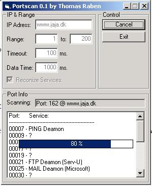



## A Portscanner

### Description

The portscanner scans for open ports on remote computers, and reconizes different services, like the HTTP and FTP, but not from the port number, eg. if you are running a FTP service om port 80, the scanner will reconize the open port as a FTP Service. (See Screenshot)
 
### More Info
 
IP, Port range.

Flrrr... se the code.

Open Ports and their service.

None (known)

             |
---                |---
**Submitted On**   |2001-01-31 16:52:54
**By**             |[Thomas Raben](https://github.com/Planet-Source-Code/PSCIndex/blob/master/ByAuthor/thomas-raben.md)
**Level**          |Advanced
**User Rating**    |4.7 (131 globes from 28 users)
**Compatibility**  |VB 4\.0 \(32\-bit\), VB 5\.0, VB 6\.0
**Category**       |[Internet/ HTML](https://github.com/Planet-Source-Code/PSCIndex/blob/master/ByCategory/internet-html__1-34.md)
**World**          |[Visual Basic](https://github.com/Planet-Source-Code/PSCIndex/blob/master/ByWorld/visual-basic.md)
**Archive File**   |[CODE\_UPLOAD143631312001\.zip](https://github.com/Planet-Source-Code/thomas-raben-a-portscanner__1-14868/archive/master.zip)

### API Declarations

absolutely none, uses winsock.

